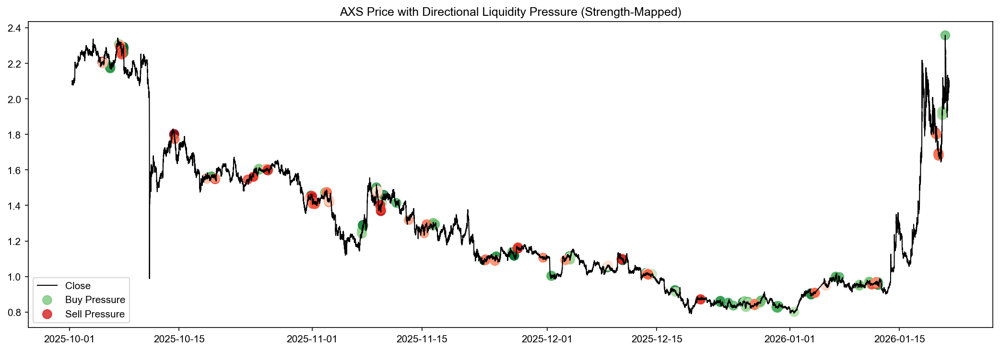

# Crypto Liquidity Regime Detection
Detect early crypto liquidity regime shifts using trade-level microstructure signals and DuckDB-powered analytics.

**Author:** Lee Zhao Jun  
**Repository:** [crypto-liquidity-regime-shift-detection-engine](https://github.com/ZhaoJunLee/Crypto-Liquidity-Regime-Shift-Detection-Engine/tree/main)  
**Last Updated:** January 2026

---

## Project Overview

This project implements a **framework for detecting directional liquidity regimes in cryptocurrency markets** using **[open-source aggregated trade data from Binance](https://data.binance.vision/?prefix=data/spot/daily/aggTrades/)**. 
It focuses on identifying **buy/sell imbalance pressure and volume bursts** as indicators of potential buying and selling opportunities.  

The methodology is inspired by professional trading research on **market microstructure and liquidity efficiency**, and is designed to help analysts or quants spot **liquidity-driven events** that can precede short-term market trends.

Key objectives:
- Build **OHLCV bars** from raw trade data.
- Compute **liquidity features**:
  - Buy/Sell Imbalance (`imbalance`)
  - Relative Volume (`vol_burst`)
  - Liquidity Efficiency (`illiquidity` – Amihud proxy)
- Detect **buy/sell pressure events** based on cumulative imbalance and volume pressure.
- Visualize events alongside price to validate signals.

---

## Installation


```bash
git clone https://github.com/<your-username>/crypto-liquidity-regime-detection.git
cd crypto-liquidity-regime-detection
python -m venv venv
source venv/bin/activate      # Linux/macOS
# venv\Scripts\activate      # Windows
pip install -r requirements.txt
```
---

## Repository Structure
```text
├── data/
│   ├── raw/         # Place .zip files here (BTC, BNB, AXS)
│   └── processed/   # DuckDB-generated Parquet files
├── notebooks/       # Main analysis (.ipynb)
├── sql/             # Aggregation logic
└── figures/         # Saved pressure event charts
```
- **[notebooks/](https://github.com/ZhaoJunLee/Crypto-Liquidity-Regime-Shift-Detection-Engine/tree/main/notebooks)**: Contains the main notebook implementing the full pipeline: data ingestion → feature engineering → regime detection → visualization.  
- **[sql/](https://github.com/ZhaoJunLee/Crypto-Liquidity-Regime-Shift-Detection-Engine/tree/main/sql)**: Optional SQL scripts for CSV → Parquet conversion and OHLCV aggregation.  
- **[figures/](https://github.com/ZhaoJunLee/Crypto-Liquidity-Regime-Shift-Detection-Engine/tree/main/figures)**: Contains example charts exported via `matplotlib.pyplot.savefig()`.

---

## Usage
1. Place raw trade data .zip files in: data/raw/<SYMBOL>/ as in Repository Structure above.
2. Run the notebook crypto_liquidity_regime.ipynb:
- Unzips and processes raw CSV files to Parquet.
- Builds OHLCV bars and calculates liquidity features.
- Detects buy/sell pressure events.
- Produces plots of price and detected events (saved in figures/).
3. Optional: Execute SQL scripts in sql/ to reproduce steps in DuckDB.

---

## Configuration

| Category | Parameter | Default Value | Description |
| :--- | :--- | :--- | :--- |
| **Asset** | `SYMBOL` | "AXS" | Target ticker for analysis. |
| **Timeframe** | `BAR_INTERVAL_MIN` | 5 | Timeframe for OHLCV aggregation. |
| | `BARS_PER_DAY` | 288 | Total bars in 24h (calculated from interval). |
| **Windows** | `FWD_RETURN_HORIZON` | 288 | Look-ahead window for return labeling (~1 day). |
| | `Z_WINDOW` | 288 | Rolling window for Z-score baselines. |
| | `DENSITY_WINDOW` | 12 | Window for imbalance density (~1 hour). |
| | `VOL_PRESSURE_WINDOW`| 288 | Window for cumulative volume pressure. |
| **Thresholds**| `IMBALANCE_DENSITY_THRESHOLD` | 0.5 | Min % of aggressive bars required for a signal. |
| | `Z_SCORE_THRESHOLD` | 1.0 | Statistical significance required for "Pressure." |

---

## Output
- OHLCV Bars: open, high, low, close, volume, buy_volume, sell_volume.
- Liquidity Features: imbalance, vol_burst, illiquidity.
- Regime Signals: pressure_signal (buy, sell, none) with pressure_strength.
- Visualization Example: 

---

## Contribution

This repository is a personal project and can be extended by:
- Adding more symbols or multiple market support.
- Integrating real-time data feeds.
- Experimenting with alternative liquidity proxies or EWMA-based z-scores.
- Improving visualization and reporting features.

---

## License
This project is open-source under the MIT License.

---

## Reference
1. Amihud, Y. (2002). Illiquidity and stock returns: cross-section and time-series effects.
2. Market Microstructure research: directional liquidity, volume imbalance, and price impact.
3. DuckDB Documentation: https://duckdb.org/

---

## Notes
- This project focuses on exploratory liquidity regime detection, not trading advice.
- Illiquidity (Amihud proxy) is computed but not directly used in the event detection; can be added for further research.
